# NutriSense 🍱
### Photo → portion → nutrients → PM POSHAN compliance verdict, for Karnataka MDM canteens

[](https://python.org)
[](https://fastapi.tiangolo.com)
[](#-testing)
[](https://huggingface.co)
[](LICENSE)

---

## 📌 Overview

NutriSense turns a single **photo of a plated mid-day meal** into a compliance verdict against the **PM POSHAN (MDM) food & nutrition guidelines**. One capture → dish identification → portion in grams → Monte Carlo nutrient intervals → **PASS / BORDERLINE / FAIL** with honest coverage and assumptions.

Everything the pipeline decides is traceable: which scale anchor was used, how large the uncertainty was, which parameters are still `assumed`, and why a verdict landed where it did. No attendance tracking, no chatbot, no database — v5 is deliberately a single, testable photo-analysis pipeline.

**What it does:**

- Measures portion size from one photo using a printed **reference card** (60 mm) as metric scale — or honestly degrades to a documented *prior* tier that can never issue PASS/FAIL
- Identifies the dish from a 46-photo gallery (SigLIP2), abstaining rather than guessing
- Estimates volume from monocular depth (MoGe-2, calibrated against the card to ~1.1% median error)
- Propagates every uncertainty through a Monte Carlo engine (4000 samples) into 90% intervals
- Scores energy & protein probabilities against the class-band minimums, gated by a **coverage** score

A React web UI wraps the pipeline: dashboard, photo analysis with honest staged progress, result detail (verdict reasons, coverage, 90% intervals), history + search, student records, menu browser, analytics, and settings.

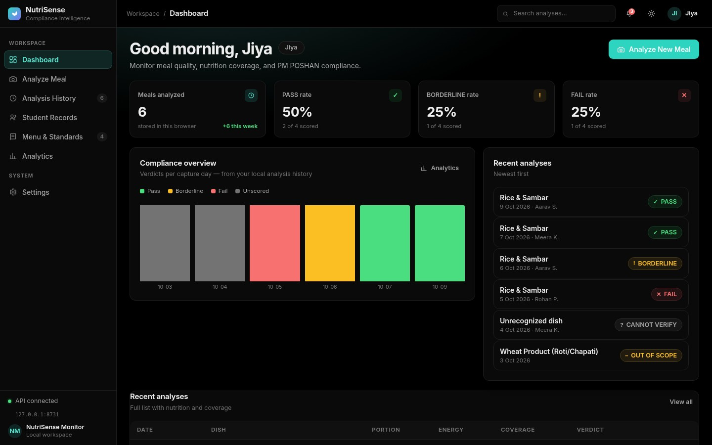

---

## 🔁 Analysis Pipeline

The actual photo → verdict flow as built (`engine/pipeline.py`):

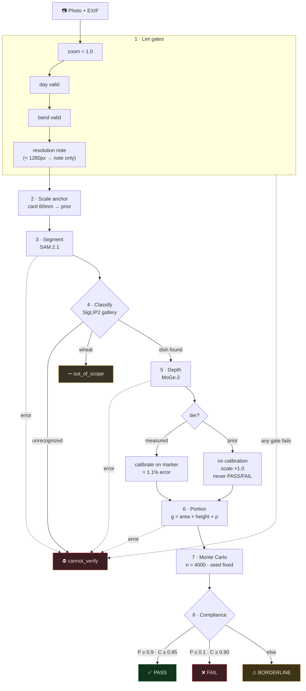

### Pipeline components

| Stage | What runs | Model / method |
|---|---|---|
| Lint | digital-zoom gate, day/band validation, resolution note | pure rules |
| S1 Scale anchor | 2 tiers: card → prior (prior caps coverage at 0.60) | ArUco card detector |
| S2 Segment | food mask from the plate photo | SAM 2.1 (`facebook/sam2.1-hiera-large`) |
| S2 Classify | gallery-first dish match with open-set abstain; text fallback | SigLIP2 (`google/siglip2-base-patch16-224`) |
| S3 Depth | metric depth, scale-calibrated against the marker | MoGe-2 (`Ruicheng/moge-2-vitl`) |
| S3 Portion | grams = anchor-scaled area × height above base × density | ring / table-prior / size-prior paths |
| S4 Nutrition | lognormal sampling of every uncertainty source | Monte Carlo, n=4000, fixed seed (sole interval owner) |
| S5 Compliance | P(at/above min) per mandatory nutrient × coverage gates | pure rules from `data/standards.yaml` |

---

## ✨ Features

**Implemented and tested (97 tests green):**

- **Two-tier scale anchor** — reference card (60 mm ArUco) or size prior; tier is always reported and gates verdict authority
- **Gallery dish classification** — 46 real dish photos, leave-one-out 46/46, abstain threshold 0.82 (synthetic renders correctly abstain)
- **Monocular depth with metric calibration** — raw MoGe scale is ~6× off out-of-domain; card calibration brings it to ~1.1% median error
- **Portion estimation** — plate +6.6% / bowl +5.6% volume vs ground truth on synthetic scenes; prior tier flagged `vessel_shape_uncertain`
- **Monte Carlo nutrient engine** — grams lognormal from per-dish σ, recipe-share noise, nutrient-table σ, temperature-scaled intervals; raw-equivalent diagnostics kept informational only
- **Compliance verdicts** — PASS ≥ P0.90 & coverage ≥ 0.85 / FAIL ≤ P0.10 & coverage ≥ 0.90 / else BORDERLINE; prior tier and wheat products can never PASS or FAIL; salt is advisory only
- **FastAPI service** — `GET /health`, `GET /menu`, `POST /analyze` with full diagnostics in every response
- **React + TypeScript frontend** — dashboard, analysis flow with honest staged progress, result views for every verdict outcome (PASS / BORDERLINE / FAIL / cannot_verify / out_of_scope), history with search, student records (name per photo), menu browser, analytics, settings — localStorage only, no backend DB
- **Themes** — 6 full themes (Light, Dark, Sepia, Midnight, OLED, System) × 6 accent palettes, light/dark aware
- **Synthetic scene renderer** — full GT (image, depth, masks, grams, anchor) powering the test suite

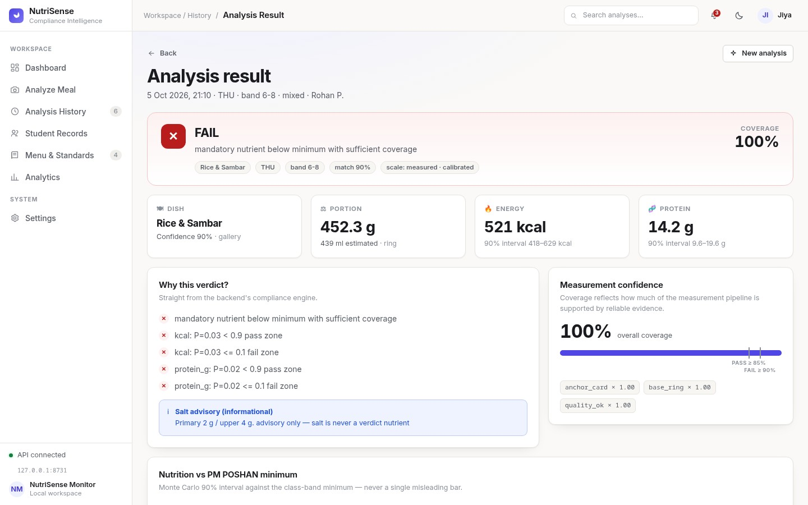

**Open gates (M1–M8, see `docs/final-report.md`):** physical reference-card run against a kitchen scale, prior-tier depth-scale validation, real-photo abstain/segmentation tuning (real canteen photos currently segment poorly — see Known Limitations), nutrient-table validation, holdout evaluation.

---

## 🖼️ Screenshots

| | |
|---|---|
| 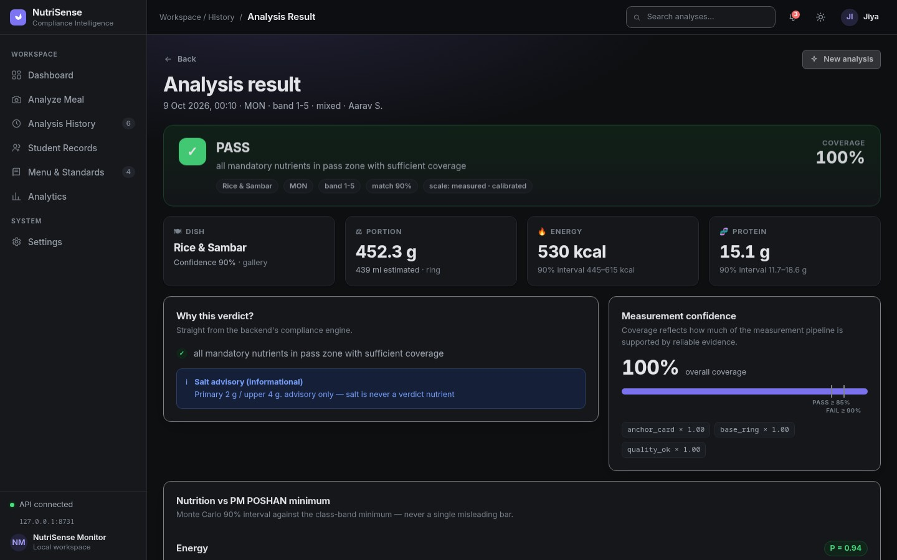 | 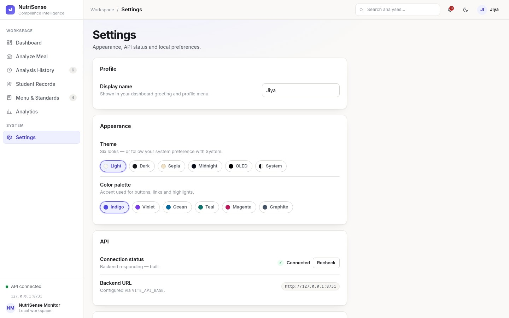 |
| *Result view — Dark theme* | *Settings — 6 themes × 6 palettes* |
| 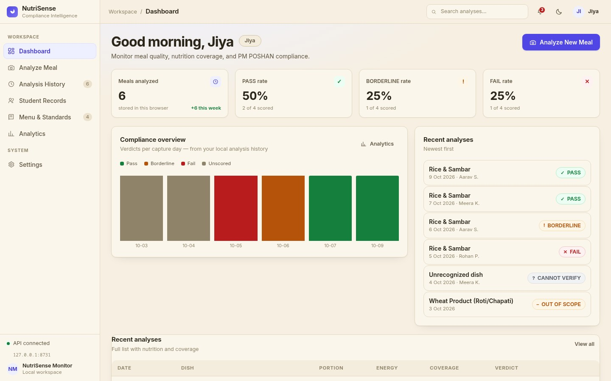 | 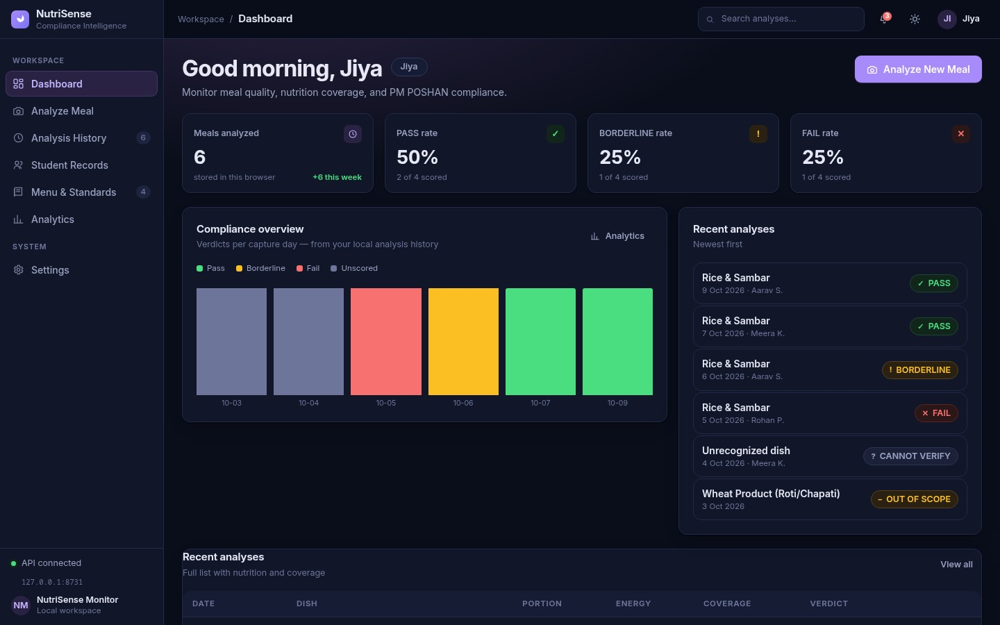 |
| *Dashboard — Sepia* | *Dashboard — Midnight + Violet accent* |
|  | 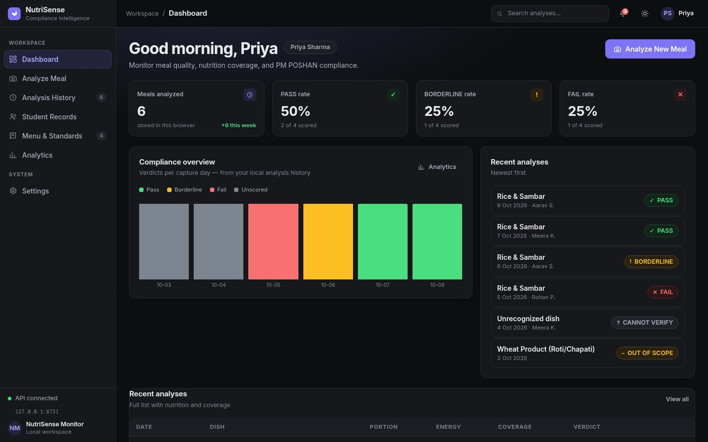 |
| *Dashboard — OLED + Teal accent* | *Dashboard — Dark + Indigo* |
| 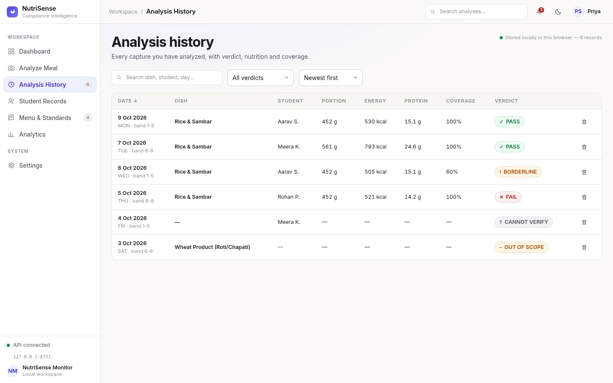 | 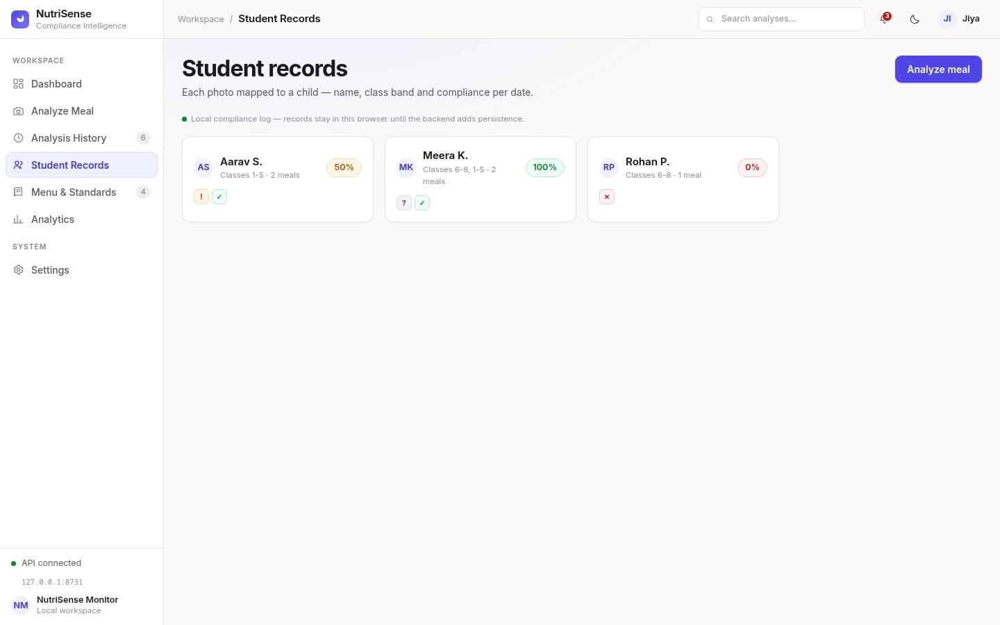 |
| *History with search* | *Student records* |
| 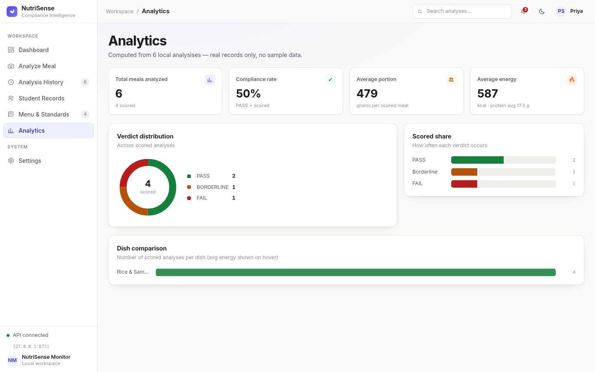 | 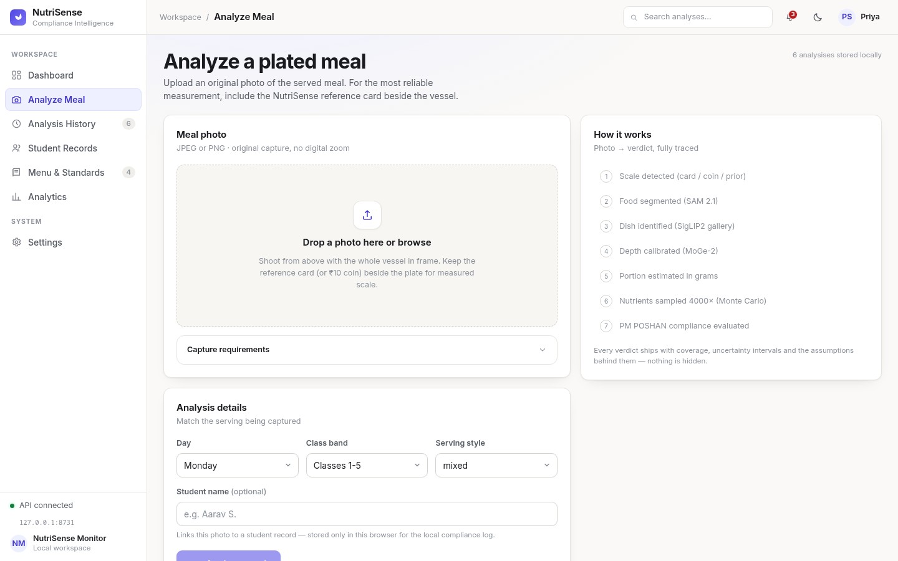 |
| *Analytics* | *Analyze — staged progress* |

---

## 🗄️ Data & Sources

| Source | What it provides | Where |
|---|---|---|
| PM POSHAN menu + F&N guidelines (user-provided doc) | dishes, days, class bands, kcal/protein minimums | `data/menu.yaml`, `data/standards.yaml` |
| IFCT 2017 (NIN Hyderabad) | boiled-rice / curd nutrient values (literature rows) | `data/nutrients.yaml` |
| Recipe assumptions | sambar, vegetable_rice, bisi_belee_bath rows (marked `assumed`) | `data/nutrients.yaml`, `data/params_status.yaml` |
| Canteen phone photos (46) | classifier gallery | `data/gallery.npz`, `../DATASET/` |
| Synthetic renderer | ground truth for the test suite | `tests/synth/` |
| Reference card (A6, 300 dpi) | metric scale marker | `docs/assets/reference_card_A6_300dpi.png` |

No USDA API, no external database, no network calls at runtime — all policy lives in versioned YAML.

---

## 🛠️ Tech Stack

| Component | Technology |
|---|---|
| Backend | FastAPI · Python 3.14 · uv-managed `.venv` |
| Vision | PyTorch 2.13 (CUDA) · SAM 2.1 · SigLIP2 · MoGe-2 via HuggingFace Transformers |
| Geometry | OpenCV 5 · NumPy 2 · custom `geo/` package |
| Uncertainty | NumPy Monte Carlo (seeded) |
| Frontend | React 18 · TypeScript · Vite 6 · hash router · pure-CSS charts (no chart runtime) |
| Tests | pytest — 97 tests (synthetic GT scenes + HTTP E2E + contract parity) |

---

## 📁 Project Structure

```
NutriSense/
├── main.py                    # FastAPI: /health /menu /analyze
├── geo/                       # camera pose, planes, quads, back-projection
├── models/
│   ├── scale_anchor.py        # S1: card / prior tiers
│   ├── dish_segmenter.py      # S2: SAM 2.1 food masking
│   ├── food_classifier.py     # S2: SigLIP2 gallery-first + text fallback
│   └── portion_estimator.py   # S3: area × height × density → grams
├── engine/
│   ├── pipeline.py            # S6: analyze() orchestration + gates
│   ├── depth.py               # MoGe-2 wrapper + marker calibration
│   ├── mc.py                  # S4: Monte Carlo (sole interval owner)
│   ├── nutrients.py           # nutrient table access
│   └── compliance.py          # S5: verdict + coverage rules
├── data/                      # single sources of truth (YAML + gallery.npz)
├── tests/                     # 97 tests incl. synth/ renderer with full GT
├── docs/                      # protocol, reports, flowchart, screenshots, card asset
├── tools/                     # reference-card generator, gallery builder
└── frontend/                  # React 18 + TypeScript UI (src/pages, src/result, src/layout)
```

---

## 🚀 Getting Started

### Prerequisites

- **uv** (Python package manager) — https://docs.astral.sh/uv/
- **Python 3.14**, **Node 20+**
- NVIDIA GPU + CUDA recommended (CPU works, slower)

### Installation

**1. Clone the repository**

```bash
git clone https://github.com/Lion4467cat/NutriSense.git
cd NutriSense
```

**2. Create the Python environment (uv)**

```bash
uv venv --python 3.14 .venv
uv pip install --python .venv/bin/python -r requirements.txt -r requirements-cv.txt
```

**3. Run the backend (port 8731)**

```bash
.venv/bin/uvicorn main:app --port 8731
```

**4. Run the frontend (separate terminal)**

```bash
cd frontend
npm install
npm run dev
```

**5. Run the tests**

```bash
.venv/bin/pytest -q
```

### Access the App

- **Frontend:** http://localhost:5173
- **Backend API Base:** http://127.0.0.1:8731
- **Interactive Docs:** `http://127.0.0.1:8731/docs`
- **Health Check:** `http://127.0.0.1:8731/health`

The frontend reads the API base from `VITE_API_BASE` (default `http://127.0.0.1:8731`). First run downloads HF model weights (~3 GB) — prefix with `HF_HUB_DISABLE_XET=1` if downloads stall. Full agent notes live in `AGENTS.md`.

---

## 📡 API Endpoints

| Method | Endpoint | Description |
|---|---|---|
| GET | `/` | Server status |
| GET | `/health` | Health check (`phase`) |
| GET | `/menu` | Dishes, days, class bands, capture fields (single source of truth) |
| POST | `/analyze` | Multipart upload (`file`, `day`, `band`, `serving_style`) → full analysis |

### Example Response — `/analyze`

Every response is the full 16-key contract (`engine/contract.py`, Zod schema generated into `frontend/src/types/contract.gen.ts`): `verdict, reasons, failures, lint, anchor, segmentation, classification, dish, portion, nutrition, coverage, assumptions, advisory, compliance, model_versions, policy`. Reasons are `{kind, text}` objects; `failures` lists only hard stage/gate failures; `policy` carries the thresholds the UI renders.

```json
{
  "verdict": "FAIL",
  "reasons": [{"kind": "below_min", "text": "mandatory nutrient below minimum with sufficient coverage"}, {"kind": "below_min", "text": "kcal: P=0.06 <= 0.1 fail zone"}],
  "failures": [],
  "policy": {"pass_p": 0.9, "fail_p": 0.1, "pass_min": 0.85, "fail_min": 0.9, "anchor_prior_cap": 0.6, "base_table_prior": 0.85, "quality_degraded": 0.9, "lint_min_side_px": 1280, "policy_version": "c65df5efee0f"},
  "lint": {"digital_zoom": null, "focal_mm": 4.0, "min_side_px": 1100, "resolution_ok": false, "notes": ["min side 1100 < 1280px (marker tier may fall back to prior)"]},
  "anchor": {"method": "card_aruco", "tier": "measured", "cm_per_px": 0.0547, "tilt_deg": 39.0, "depth_scale_factor": 0.1417, "depth_scale_source": "card"},
  "classification": {"dish": "rice_sambar", "confidence": 0.9, "method": "gallery"},
  "dish": {"id": "rice_sambar", "display_name": "Rice & Sambar", "day": "mon", "band": "1-5"},
  "portion": {"grams": 298.5, "volume_ml": 354.8, "base_method": "ring", "scale_tier": "measured", "sigma_grams_rel": 0.37, "flags": []},
  "nutrition": {"kcal": {"mean": 271.0, "interval_90": [141.0, 466.0]}, "protein_g": {"mean": 7.3, "interval_90": [3.8, 12.5]}},
  "coverage": {"score": 1.0, "factors": {}, "pass_min": 0.85, "fail_min": 0.9},
  "compliance": {"day": "mon", "band": "1-5", "probs": {"kcal": 0.06, "protein_g": 0.06}, "nutrients": {"kcal": {"min": 450.0, "p_at_or_above_min": 0.06, "interval_90": [141.0, 466.0]}}},
  "assumptions": ["nutrient table row sambar (assumed)"],
  "advisory": {"note": "advisory only — salt is never a verdict nutrient"},
  "model_versions": {"segmenter": "facebook/sam2.1-hiera-large", "classifier": "google/siglip2-base-patch16-224", "depth": "Ruicheng/moge-2-vitl"}
}
```

---

## 📸 Data Capture Procedure (golden set)

**Full field manual: [`docs/data-collection-manual.md`](docs/data-collection-manual.md)** — camera settings, exact height/angle/distance, per-plate steps, metadata templates, on-site QA checklists, the 5-day schedule, and the post-collection tuning workflow. Quick version: [`docs/protocol.md`](docs/protocol.md).

Goal: **30 golden plates** — 4 pilot / 13 dev / 13 holdout — for calibration, tuning, and one sealed final evaluation.

Field essentials:

- Print `docs/assets/reference_card_A6_300dpi.png` on **A6 at 100% scale (fit-to-page OFF)**; ruler-check the black square = **100.0 mm ± 0.5** before Day 1; kitchen scale with 1 g resolution, tare first.
- Digital zoom **OFF** (hard gate → `cannot_verify`), min side ≥ 1280 px, marker ≥ 80 px (≈ ⅛ frame width), tilt **< 50°**, EXIF intact — **transfer originals by cable, never a chat app**.
- Golden plates live in `DATASET/golden/{pilot,dev,holdout}/plate_XX/{photo.jpg, meta.json, weights.json}` — never in gallery class folders.

### What the pipeline checks for you (capture lint)

| Check | Consequence if violated |
|---|---|
| digital zoom == 1.0 | hard gate → `cannot_verify` |
| min side ≥ 1280 px | note in response; marker tier may fall back |
| card marker ≥ 80 px | falls back to prior tier → coverage capped at 0.60, **can never PASS/FAIL** |
| plate weight inside `plate_sanity_g` band (`data/standards.yaml`, ±25%) | flagged only — never auto-rejects |
| day ∈ menu days, dish ∈ `data/menu.yaml` ids | `cannot_verify` |

---

## 🎯 Compliance Standards

Policy lives verbatim in `data/standards.yaml` (transcribed from the user's PM POSHAN Food & Nutrition guidelines):

| Class band | Energy (min) | Protein (min) |
|---|---|---|
| 1–5 | 450 kcal | 12 g |
| 6–8 | 700 kcal | 20 g |
| 9–10 | 700 kcal | 20 g *(identical rows in the source doc)* |

- **Verdicts**: PASS needs P ≥ 0.90 *and* coverage ≥ 0.85; FAIL needs P ≤ 0.10 *and* coverage ≥ 0.90; everything else is BORDERLINE
- **Coverage** multiplies ledger factors (anchor tier, base-plane method, capture quality) — a prior-tier anchor caps it at 0.60, so a guessed scale can never FAIL a plate
- **Salt** (2 g primary / 4 g upper) is reported as an advisory only — never a verdict nutrient
- Raw per-child/day gram allocations are surfaced as informational diagnostics, never compared against cooked plate weight

---

## 🌍 SDG Alignment

| SDG | Goal | Target | How NutriSense contributes |
|---|---|---|---|
| SDG 2 | Zero Hunger | **2.2** — end all forms of malnutrition by 2030 | Verifiable per-plate energy & protein adequacy against PM POSHAN minimums — turns *"a meal was served"* into *"the meal met the standard"*, with quantified uncertainty and honest coverage |
| SDG 3 | Good Health and Well-being | **3.4** — reduce premature mortality from non-communicable diseases | Childhood undernutrition tracks into lifelong health risks; per-plate checks make dietary deficits visible early, meal by meal, instead of at annual surveys |
| SDG 4 | Quality Education | **4.1** — ensure free, equitable and quality primary/secondary education | PM POSHAN explicitly aims to lift enrolment, attendance and learning levels; NutriSense protects the meal quality those outcomes depend on |

---

## 👥 Team

| Name | USN | Role |
|---|---|---|
| Aryan Kumar | 1BM23AI037 | System Architecture & Integration |
| Roshanth V | 1BM23AI155 | Food Detection & ML Pipeline |
| S S Gokula Swamy | 1BM23AI158 | Database & Backend |
| Somanath S D | 1BM23AI187 | Agentic AI & Compliance Engine |

**Guide:** Prof. Varsha R, Dept. of Machine Learning, BMSCE

---

## 🏫 Institution

**Department of Machine Learning**
B.M.S. College of Engineering, Bengaluru — 560 019
*(An Autonomous Institute, Affiliated to VTU)*

**Course:** Project Work 2 (24AM7PWPW2)
**Academic Year:** 2026–27

---

## ⚠️ Known Limitations

- **Real-photo segmentation & anchor**: fully validated on synthetic scenes (97 tests green), but real canteen photos currently segment poorly (tiny masks → ~0 g) — the M1/M3 real-world tuning gate. Until it closes, treat field results as indicative.
- **Prior tier depth scale** is uncalibrated (`depth_scale_sigma_pct` open at M6).
- **Assumed nutrient rows**: sambar / vegetable_rice / bisi_belee_bath values are literature-plausible assumptions, flagged in every response (`assumptions`).

---

## 📚 References

**Models & methods**

1. Ravi et al. (2024). *SAM 2: Segment Anything in Images and Videos.* arXiv:2408.00714. — image segmentation (S2).
2. Tschannen et al. (2025). *SigLIP 2: Multilingual Vision-Language Encoders with Improved Semantic Understanding, Localization, and Dense Features.* arXiv:2502.14786. Google DeepMind. — dish gallery embeddings (S2).
3. Wang et al. (2025). *MoGe-2: Accurate Monocular Geometry with Metric Scale and Sharp Details.* arXiv:2507.02546 (NeurIPS 2025). Microsoft Research. — metric depth (S3).
4. Garrido-Jurado et al. (2014). *Automatic generation and detection of highly reliable fiducial markers under occlusion.* Pattern Recognition 48(6), 2051–2061. — ArUco reference-card detection (S1 scale anchor).

**Nutrition & policy**

5. National Institute of Nutrition (2017). *Indian Food Composition Tables (IFCT 2017).* NIN, Hyderabad. — literature nutrient rows in `data/nutrients.yaml`.
6. Ministry of Education, Government of India. *PM POSHAN — Food & Nutrition Guidelines.* — band minimums & compliance rules, transcribed into `data/standards.yaml`.
7. Government of Karnataka. *Mid-Day Meal Scheme Guidelines.* Dept. of Public Instruction. — weekly menu in `data/menu.yaml`.

---

## 📄 License

[MIT](LICENSE) — © 2026 S S Gokula Swamy. Developed for Project Work 2 (2026–27) at B.M.S. College of Engineering. Model/dataset attributions: `docs/licenses.md`.
