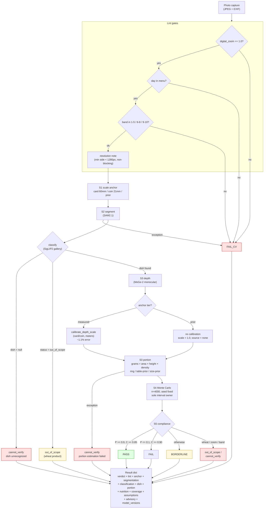

# NutriSense 🍱
### An Agentic AI-Based System for Automated Food Analysis, Nutritional Compliance Checking, and Meal Attendance Tracking

[](https://python.org)
[](https://fastapi.tiangolo.com)
[](https://huggingface.co)
[](LICENSE)

---

## 📌 Overview

NutriSense is an intelligent, camera-based nutritional monitoring system designed specifically for **Karnataka government school canteens** under the **Mid-Day Meal (MDM) Scheme**. It automates food detection, nutrition analysis, dietary compliance checking, and meal attendance tracking using computer vision, deep learning, and agentic AI.

The system addresses a critical gap in institutional food service: manual nutritional assessment is slow, inconsistent, and cannot scale to hundreds of meals served daily. NutriSense replaces this with a fully automated pipeline — from tray photo to compliance report — in under 5 seconds.

---

## 🎯 Problem Statement

Institutions like government schools, hospitals, hostels, and corporate canteens serve hundreds of meals daily. Ensuring nutritional adequacy through manual inspection is:
- **Slow** — dietitians cannot check every meal
- **Inconsistent** — results vary between inspectors
- **Disconnected** — attendance and nutrition data are never linked
- **Non-localised** — existing tools use USDA data, which has no data on ragi mudde, jolada rotti, or bisibelebath

NutriSense solves all of these problems in one integrated pipeline.

---

## 🏗️ System Architecture

```
┌─────────────────────────────────────────────────────────┐
│                    LAYER 1 — INPUT                      │
│   Meal Tray Camera │ Face Camera │ Admin Panel          │
└─────────────────────────┬───────────────────────────────┘
                          │ FastAPI Gateway (JSON)
┌─────────────────────────▼───────────────────────────────┐
│                 LAYER 2 — VISION PIPELINE               │
│   Food Detector (ViT) │ Portion Estimator │ DeepFace    │
└─────────────────────────┬───────────────────────────────┘
                          │ food list, portions, user ID
┌─────────────────────────▼───────────────────────────────┐
│          LAYER 3 — NUTRITION & COMPLIANCE               │
│  Karnataka DB → IFCT 2017 → USDA → Compliance Engine   │
└─────────────────────────┬───────────────────────────────┘
                          │ compliance report
┌─────────────────────────▼───────────────────────────────┐
│              LAYER 4 — AGENTIC AI LAYER                 │
│  Orchestrator Agent │ Suggestion Agent │ Planner Agent  │
└─────────────────────────┬───────────────────────────────┘
                          │ meal logs, menu plans, alerts
┌─────────────────────────▼───────────────────────────────┐
│          LAYER 5 — STORAGE, DASHBOARD & ALERTS          │
│      PostgreSQL │ React Dashboard │ Alert System        │
└─────────────────────────────────────────────────────────┘
```

### 🔁 Analysis Pipeline Flowchart (v5)

The actual photo → verdict pipeline as built (`engine/pipeline.py`):



---

## ✨ Features

### ✅ Implemented (Phase 1–4)

- **Multi-item Food Detection** — ViT model (Food-101 pretrained) with quadrant-splitting for detecting multiple items on a single tray. ⚠️ *Currently trained on Food-101 (international dishes) — accuracy on Indian/Karnataka dishes is limited since the model hasn't been fine-tuned on local food images yet. This is a known limitation, tracked for Phase 5.*
- **4-Layer Nutrition Lookup** — Priority-based lookup chain:
  1. Karnataka Local DB (ragi mudde, jolada rotti, bisibelebath, sajje rotti...)
  2. IFCT 2017 — NIN Hyderabad (528 Indian foods)
  3. USDA FoodData Central (international fallback)
  4. Default safe estimate
- **Compliance Engine** — Checks against Karnataka MDM Scheme + ICMR-NIN 2020 + FSSAI + WHO standards
- **Student Supplement Tracking** — Tracks egg, banana, milk, chikki distributed separately from tray
- **Tap-to-Select UI API** — Returns structured supplement options for frontend rendering
- **React Dashboard (Frontend)** — Tray image upload, supplement selector, compliance report with nutrient breakdown, bar chart visualization, and floating AI chatbot widget (gracefully prompts for API key if not configured)

### 🔄 In Progress (Phase 5–7)

- Fine-tuning food detection model on Indian/Karnataka food images for improved accuracy
- Face recognition attendance tracking (DeepFace)
- Agentic AI layer (LangChain — orchestrator, suggestion, planner agents) — chatbot endpoint scaffolded, requires ANTHROPIC_API_KEY to activate
- PostgreSQL meal logging with user linkage
- Email/SMS alert system for canteen managers

---

## 🗄️ Datasets Used

| Dataset | Source | Purpose |
|---|---|---|
| Food-101 | ETH Zurich (via HuggingFace `nateraw/food`) | Food item classification |
| IFCT 2017 | National Institute of Nutrition, Hyderabad | Indian food nutrition values |
| Karnataka Local Foods | Created by team (based on IFCT + MDM data) | Karnataka-specific staples |
| USDA FoodData Central | USDA Agricultural Research Service | International fallback nutrition |
| Karnataka MDM Scheme | Government of Karnataka | Per-meal compliance thresholds |
| ICMR-NIN RDA 2020 | Indian Council of Medical Research | Daily nutrient requirements |

---

## 🛠️ Tech Stack

| Component | Technology |
|---|---|
| Backend | FastAPI (Python 3.13) |
| Food Detection | Vision Transformer (ViT) via HuggingFace Transformers |
| Face Recognition | DeepFace |
| Nutrition Database | IFCT 2017 + Karnataka Local DB + USDA API |
| Agentic AI | LangChain + Claude/GPT-4 |
| Database | PostgreSQL |
| Frontend | React.js + Chart.js |
| Containerization | Docker Compose |

---

## 📁 Project Structure

```
NutriSense/
├── main.py                      # FastAPI entry point — all endpoints
├── requirements.txt             # Python dependencies
├── .env                         # API keys (not committed)
├── .gitignore
│
├── models/
│   ├── food_detector.py         # ViT food detection + quadrant splitting
│   ├── nutrition_lookup.py      # 4-layer nutrition lookup chain
│   └── face_recognizer.py       # DeepFace attendance tracking
│
├── engine/
│   ├── compliance_engine.py     # Karnataka MDM + ICMR-NIN compliance check
│   └── aggregator.py            # Combines multi-item nutrition into meal total
│
├── agents/
│   ├── orchestrator.py          # LangChain orchestrator agent
│   ├── suggestion_agent.py      # AI corrective recommendations
│   └── planner_agent.py         # Next-day menu planning agent
│
├── database/
│   ├── db.py                    # PostgreSQL connection + SQLAlchemy models
│   └── schemas.py               # Pydantic schemas for request/response
│
└── data/
    ├── karnataka_foods.csv      # Karnataka-specific food nutrition DB
    └── ifct_foods.py            # IFCT 2017 — 528 Indian foods
```

---

## 🚀 Getting Started

### Prerequisites

Before you begin, make sure you have these installed:

- **Python 3.10+** — download from python.org/downloads. During install on Windows, check "Add python.exe to PATH".
- **Git** — download from git-scm.com/downloads
- **PostgreSQL** — download from postgresql.org/download. Remember the password you set for the postgres user during install.

### Installation

**1. Clone the repository**

```bash
git clone https://github.com/Lion4467cat/NutriSense.git
cd NutriSense
```

**2. Create the Python environment (uv)**

```bash
uv venv --python 3.14 .venv
uv pip install --python .venv/bin/python -r requirements.txt -r requirements-cv.txt
```

**3. Run the backend (port 8731)**

```bash
.venv/bin/uvicorn main:app --port 8731
```

**4. Run the frontend (separate terminal)**

```bash
cd frontend
npm install
npm run dev
```

**5. Run the tests**

```bash
.venv/bin/pytest -q
```

### Access the App

- **Frontend:** http://localhost:5173
- **Backend API Base:** http://127.0.0.1:8731
- **Interactive Docs:** `http://127.0.0.1:8731/docs`
- **Health Check:** `http://127.0.0.1:8731/health`

The frontend reads the API base from `VITE_API_BASE` (default `http://127.0.0.1:8731`). HF model downloads need `HF_HUB_DISABLE_XET=1` prefixed in this environment. Full agent notes live in `AGENTS.md`.

---

## 📡 API Endpoints

| Method | Endpoint | Description |
|---|---|---|
| GET | `/` | Server status |
| GET | `/health` | Health check (`phase`) |
| GET | `/menu` | Dishes, days, class bands, capture fields (single source of truth) |
| POST | `/analyze` | Multipart upload (`file`, `day`, `band`, `serving_style`) → full analysis |

### Example Response — `/analyze`

```json
{
  "verdict": "FAIL",
  "reasons": ["mandatory nutrient below minimum with sufficient coverage", "kcal: P=0.06 <= 0.1 fail zone"],
  "lint": {"digital_zoom": null, "min_side_px": 1100, "resolution_ok": false, "notes": ["min side 1100 < 1280px (marker tier may fall back to prior)"]},
  "anchor": {"method": "card_aruco", "tier": "measured", "cm_per_px": 0.0547, "tilt_deg": 39.0, "depth_scale_factor": 0.1417, "depth_scale_source": "card"},
  "classification": {"dish": "rice_sambar", "confidence": 0.9, "method": "gallery"},
  "dish": {"id": "rice_sambar", "display_name": "Rice & Sambar", "day": "mon", "band": "1-5"},
  "portion": {"grams": 298.5, "volume_ml": 354.8, "base_method": "ring", "scale_tier": "measured", "sigma_grams_rel": 0.37, "flags": []},
  "nutrition": {"kcal": {"mean": 271.0, "interval_90": [141.0, 466.0]}, "protein_g": {"mean": 7.3, "interval_90": [3.8, 12.5]}},
  "coverage": {"score": 1.0, "factors": {"anchor": 1.0, "base": 1.0}, "pass_min": 0.85, "fail_min": 0.9},
  "compliance": {"day": "mon", "band": "1-5", "probs": {"kcal": 0.06, "protein_g": 0.06}, "nutrients": {"kcal": {"min": 450.0, "p_at_or_above_min": 0.06, "interval_90": [141.0, 466.0]}}},
  "assumptions": ["nutrient table row sambar (assumed)"],
  "advisory": {"note": "advisory only — salt is never a verdict nutrient"},
  "model_versions": {"segmenter": "facebook/sam2.1-hiera-large", "classifier": "google/siglip2-base-patch16-224", "depth": "Ruicheng/moge-2-vitl"}
}
```

---

## 🎯 Compliance Standards Used

| Standard | Source | What it governs |
|---|---|---|
| Karnataka MDM Scheme | Govt. of Karnataka | Per-meal calorie and calcium targets |
| ICMR-NIN RDA 2020 | Indian Council of Medical Research | Protein, carbs, fat, fiber, iron |
| FSSAI Guidelines | Food Safety and Standards Authority of India | Fat limits for school canteens |
| WHO Guidelines | World Health Organization | Vitamin C minimum |

---

## 🌍 SDG Alignment

| SDG | Goal | How NutriSense contributes |
|---|---|---|
| SDG 3 | Good Health and Well-Being | Continuous nutritional monitoring prevents deficiencies |
| SDG 9 | Industry, Innovation and Infrastructure | Open-source AI applied to public health infrastructure |

---

## 👥 Team

| Name | USN | Role |
|---|---|---|
| Aryan Kumar | 1BM23AI037 | System Architecture & Integration |
| Roshanth V | 1BM23AI155 | Food Detection & ML Pipeline |
| S S Gokula Swamy | 1BM23AI158 | Database & Backend |
| Somanath S D | 1BM23AI187 | Agentic AI & Compliance Engine |

**Guide:** Prof. Varsha R, Dept. of Machine Learning, BMSCE

---

## 🏫 Institution

**Department of Machine Learning**
B.M.S. College of Engineering, Bengaluru — 560 019
*(An Autonomous Institute, Affiliated to VTU)*

**Course:** Project Work 2 (24AM7PWPW2)
**Academic Year:** 2026–27

---

## ⚠️ Known Limitations

- **Real-world calibration gates (M1–M6)**: the pipeline is fully validated on synthetic scenes (69+ tests green) but physical-marker runs, prior-tier depth scale, and real-photo abstain thresholds are still open gates — see `docs/final-report.md`.
- **No chatbot or database**: v5 is a pure photo → verdict pipeline (FastAPI + local models). The old chatbot/PostgreSQL stack described in earlier iterations was removed in the baseline cleanup.

---

## 📚 References

1. Bossard et al. (2014). Food-101 — Mining Discriminative Components with Random Forests. ECCV.
2. National Institute of Nutrition (2017). Indian Food Composition Tables (IFCT 2017). NIN, Hyderabad.
3. ICMR-NIN (2020). Recommended Dietary Allowances for Indians. New Delhi.
4. USDA Agricultural Research Service. FoodData Central. https://fdc.nal.usda.gov/
5. Dosovitskiy et al. (2020). An Image is Worth 16x16 Words: Transformers for Image Recognition at Scale. ICLR.
6. Taigman et al. (2014). DeepFace: Closing the Gap to Human-Level Performance in Face Verification. CVPR.
7. Chase, H. (2022). LangChain. https://github.com/langchain-ai/langchain
8. Government of Karnataka. Mid-Day Meal Scheme Guidelines. Dept. of Public Instruction.

---

## 📄 License

This project is developed for academic purposes at B.M.S. College of Engineering under Project Work 2 (2026–27).
