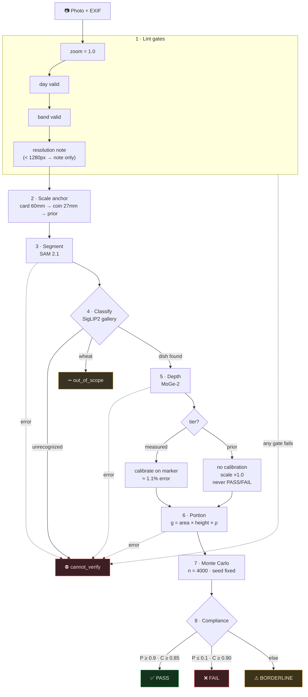
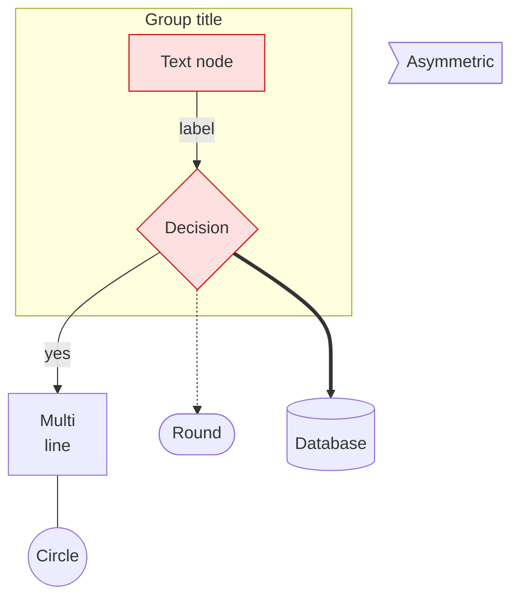

# NutriSense Pipeline — TDD Test Report

**Date:** 2026-10-08
**Method:** TDD skill (confirmed seams → vertical slices → red→green loop)
**Suite:** `69 passed in 82s` (58 pre-existing + 11 new seam tests)

## 1. Seam inventory (confirmed with user)

Per the TDD skill, no test was written at an unconfirmed seam. Seven gap seams were proposed after mapping `analyze()` + the HTTP surface against existing coverage, and the user confirmed **all 7**.

| # | Seam | Public boundary | Pre-existing coverage | This run |
|---|---|---|---|---|
| 1 | Lint resolution-note branch | `analyze()` → `lint` block | zoom/day/band gates covered; note branch never asserted | 2 tests |
| 2 | Segment-failure branch | `analyze(deps={"segment"})` → `cannot_verify` | none | 1 test |
| 3 | Classify-unrecognized branch | `analyze(deps={"classify"})` → `cannot_verify` | out-of-scope covered only | 1 test |
| 4 | Depth-calibration wiring | `analyze(deps={"depth"})` → `anchor.depth_scale_*` | anchor tier covered in isolation | 2 tests |
| 5 | Portion-failure branch | `analyze(deps={"depth"})` → `cannot_verify` | none | 1 test |
| 6 | Result-assembly contract | `analyze()` return dict (API spec) | happy-path E2E asserted a few fields | 2 tests |
| 7 | HTTP contract | `POST /analyze` validation + echo | /health, /menu, unreadable, bad band covered | 2 tests |

**Already covered before this run** (left untouched): scale anchor tiers, portion ring/prior/table paths, MC engine, compliance verdict rules, happy-path E2E, zoom/day/band gates, out-of-scope dish.

## 2. Red→green log (one slice at a time)

| Slice | Test | First run | Notes |
|---|---|---|---|
| 1 | `test_lint_resolution_note_is_non_blocking` | 🟢 green | Default scene min side 1100 < 1280 — note branch was live but unasserted |
| 1 | `test_lint_resolution_ok_large_image` | 🟢 green | Complement branch (≥1280 → no notes, non-blocking) |
| 2 | `test_segment_failure_cannot_verify` | 🟢 green | Confirms anchor runs before segment; failure surfaces reason verbatim |
| 3 | `test_classify_unrecognized_cannot_verify` | 🟢 green | Classification summary + segmentation retained on early exit |
| 4 | `test_depth_scale_calibrated_and_recorded` | 🟢 green | Card → `depth_scale_source ∈ {card, coin}`, factor ∈ (0.5, 2.0) vs metric GT |
| 4 | `test_depth_scale_none_on_prior_tier` | 🟢 then tightened → 🟢 | First assertion allowed PASS/FAIL — plan forbids it; tightened to `== "BORDERLINE"` and re-ran |
| 5 | `test_depth_failure_cannot_verify` | 🟢 green | `portion estimation failed` reason; dish info retained |
| 6 | `test_result_contract_keys_and_types` | ⚠️ vacuous → fixed → 🟢 | Flag-vocabulary subset guessed wrong (`size_prior/low_area` don't exist) and passed vacuously; corrected to the real vocabulary (`depth_partial, vessel_shape_uncertain, base_sign_flip, thin_layer, size_prior_scale`) |
| 6 | `test_result_contract_flags_populated_on_ring_path` | 🟢 green | Card + healthy area → `base_method == "ring"`, no flags |
| 7 | `test_http_missing_required_field_422` | 🟢 green | FastAPI 422 with `loc` naming `band` |
| 7 | `test_http_serving_style_echo` | 🟢 green | Full GPU E2E (real anchor + SAM + MoGe); stub classifier only |

**Red events:** none from production code — every branch already behaved per spec (all tests pass first run). The loop still earned its keep: two of *my own* expectations were wrong and were corrected under red-ish conditions (tightened prior-verdict rule, replaced a vacuous assertion). A genuine red here would have meant a pipeline bug.

**Anti-patterns avoided (per skill):**
- No internal mocking — all tests drive `analyze()` via its public `deps` seam and the HTTP API; only the classifier is stubbed (deterministic gallery abstain on synthetic renders, same pattern as existing E2E).
- No tautologies — expected values are spec literals (response key set, flag vocabulary, plan verdict rules, metric GT depth), not recomputed the way the code computes them.
- Vertical slices — each test was written, run, and settled before the next began.

## 3. Final suite

```
69 passed in 82.42s
```

| File | Tests | Phase |
|---|---|---|
| tests/test_geo.py | 6 | S0 |
| tests/test_card.py | 4 | S1 |
| tests/test_scale_anchor.py | 6 | S1 |
| tests/test_renderer.py | 5 | S0/S1 |
| tests/test_s2.py | 3 | S2 |
| tests/test_portion.py | 7 | S3 |
| tests/test_mc.py | 7 | S4 |
| tests/test_compliance.py | 9 | S5 |
| tests/test_api.py | 7 | S6 |
| **tests/test_pipeline_seams.py** | **11** | **S6 seams (this run)** |

## 4. Pipeline flowchart



## 5. Mermaid syntax reference

Minimal syntax needed for the flowchart above (and the common extensions):

````

````

What each line shows: `flowchart TD` = type + direction; `%%` = comment (own line only — inline `#` comments are a parse error); node shapes in declaration order = rectangle `["…"]`, rhombus `{"…"}`, line break `<br/>`, stadium `(["…"])`, cylinder `[(…)]`, circle `((…))`, flag `>…]`; links = arrow `-->`, labeled `-->|"…"|`, dotted `-.->`, thick `==>`, open `---`; `subgraph … end` = group; `classDef` + `class` = styling.

Key rules:

- **Front fence:** the code must be fenced as ` ```mermaid ` for renderers (GitHub, opencode preview, mermaid.live) to draw it.
- **First line** declares the diagram type: `flowchart` (or `graph`), followed by direction: `TB`/`TD` (top→down), `LR` (left→right), `BT`, `RL`.
- **Nodes:** declared implicitly by first reference (`A --> B`), labeled explicitly with `id["label"]`. Shape delimiters: `["…"]` rect, `{"…"}` rhombus, `("…")` round, `(["…"])` stadium, `(("…"))` circle, `["…"]:::class`.
- **Links:** `-->` arrow, `-.->` dotted, `==>` thick, `---` open; labels go in pipes: `-->|"text"|`.
- **Line breaks** inside labels: `<br/>` (quotes required when the label contains spaces or punctuation).
- **subgraph/end** groups nodes; `subgraph ID["Title"]`.
- **Styling:** `classDef name fill:#hex,stroke:#hex,color:#hex` then `class nodeId1,nodeId2 name`, or `style nodeId fill:…`.
- **Comments:** `%%` at line start. **Escapes:** wrap any label containing `(){}[]#,;` in double quotes.

Other diagram types available with the same fence: `sequenceDiagram`, `gantt`, `pie`, `stateDiagram-v2`, `classDiagram`, `erDiagram`.
